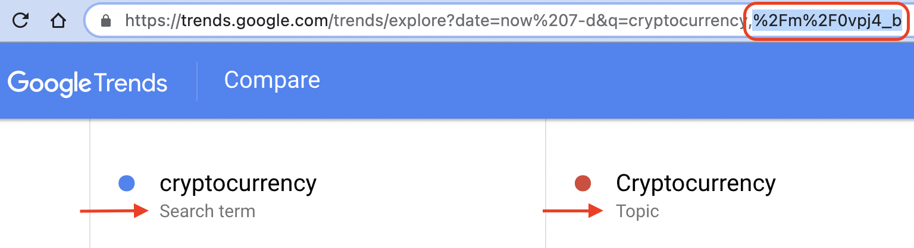

```{r setup, include=FALSE}
knitr::opts_chunk$set(echo = TRUE,
                      message=FALSE,
                      warning=FALSE)
```

## Google Trends package

Explore capabilities of the 
**gtrendsR** package created by Philippe Massicotte <br  />
[gtrendsR vignette](https://cran.r-project.org/web/packages/gtrendsR/gtrendsR.pdf)

Other useful references: <br />
* https://blog.quiet.ly/industry/exploring-google-trends-explore-function-finding-keywords-queries/ 
* https://blog.google/products/search/15-tips-getting-most-out-google-trends/
    + this is the more authoritative and recent blog post

Libraries used:

```{r}
library(gtrendsR) ## package for accessing Google Trends
library(tidyverse)
library(lubridate)
library(scales)
library(plotly)
library(gridExtra)

## set default ggplot2 chart theme
theme_set(theme_light())
```

## Google Trends Parameters

Major parameters to fine-tune queries. These correspond with the options in the Google Trend online interface.

* **Dates**:
    + "now 1-H": last hour - by MINUTE
    + "now 4-H": last 4 hrs - by MINUTE
    + "now 1-d": last day - every 8 MINUTES
    + "now 7-d": last 7 days - HOURLY data
    + "today 1-m": last 30 days - DAILY data
    + "today 3-m": last 90 days - DAILY data
    + "today 12-m": last 12 months - WEEKLY data
    + "today+5-y": last 5 yrs (default) - WEEKLY data
    + "all" since beginning of Google Trends 2004
    + "YYYY-MM-DD YYYY-MM-DD": custom start / end date - granularity will depend on time spans above
<br />    
* **Geo**:
   + use gtrendsR::countries to see complete list
   + close to 110,000 options, including country / state / city
   + code below shows how to filter for countries
   + **geo=""** for all countries
<br />   
* **Categories**:
    + use gtrendsR::categories
    + over 1,400 categories, with ids that are used in the query
    + **category = 0** for all categories
<br />    
* **Google properies**:
    + specify one or more of 'web', 'news', 'images', 'froogle', 'youtube'
    + gprop=c("web", "youtube") as example for web and youtube search

```{r}
## Country list
## use geo="" for world
ctry_list_sub <- gtrendsR::countries
ctry_list <- ctry_list_sub %>% filter(is.na(sub_code) & !is.na(name) & !grepl("=",name)) %>%
  select(-sub_code)

## Google trends categories
cat_list <- gtrendsR::categories
```

## Example 1: single term

Using the gtrendsR package to get Google Trends for a single search term.

```{r}
## basic search
## use gtrendsR to call google trends API
gt_results <- gtrends(keyword='cryptocurrency',
        geo="",
        time="now 7-d",
        gprop=c("web"),
        category=0)
```

Returns a bundle of 7 data frames with different info, reflecting what is shown in the Google Trends interface:

```{r}
names(gt_results)
```

### Interest over time

The main data with search terms for the selected search term, country, period, property, and category.

```{r}
chart_title <- "Searches for: cryptocurrency"
sub_title <- "Period: past 7 days; Geo: world; Prop: 'web'; Category: all"

gt_results$interest_over_time %>% ggplot(aes(x=date, y=hits, color=keyword))+geom_line()+
  labs(title=chart_title, subtitle=sub_title, x="", y="")

```

### Interest by Country

Breaking out level of interest for the term within countries. This is helpful in understanding what geographic regions have higher interest in the term, but is **not** what you may think it is:

* NOT a ranking of where in the world searches the most searches are coming from on the target keyword.
* Rather, it is a ranking of countries where searches for this term are the **highest proportion of overall searches within that country**.

Again, gtrendsR is just fetching the same info that you would see in the Google Trends interface.

```{r}
## need to filter for top 20 countries
top <- gt_results$interest_by_country %>% filter(!is.na(hits)) %>% slice_max(order_by=hits, n=20)

chart_title <- "Countries with highest relative interest in cryptocurrency"
sub_title <- "(based on overall searches w/in country - not worldwide searches)"
top %>% ggplot(aes(x=reorder(location, hits), y=hits))+geom_col()+
  coord_flip()+
  scale_y_continuous(expand=expansion(add=c(0,5)))+
  labs(title=chart_title, subtitle=sub_title, x='relative searches', y="")
```

### Related Topics

```{r}
  chart_title <- "crytopcurrency: related topics"
  top <- gt_results$related_topics %>% filter(related_topics=='top' & !is.na(subject) &
                                                subject!='<1')
  top$value <- as.factor(top$value)
  top$subject <- as.numeric(top$subject)
  top %>% ggplot(aes(x=reorder(value, subject), y=subject))+geom_col()+
  coord_flip()+
    scale_y_continuous(expand=expansion(add=c(0,10)))+
    labs(title=chart_title, y='', x='')
```

### Related Queries

```{r}
  chart_title <- "crytopcurrency: related queries"
  top <- gt_results$related_queries %>% filter(related_queries=='top')
  top$value <- as.factor(top$value)
  top$subject <- as.numeric(top$subject)
  top %>% ggplot(aes(x=reorder(value, subject), y=subject))+geom_col()+
  coord_flip()+
    scale_y_continuous(expand=expansion(add=c(0,10)))+
    labs(title=chart_title, y='', x='')
```

## Example 1a: specific type of search

You may notice in the Google Trends interface that when you type in various terms, different 'types' of searches for a given term may be suggested.

* instead of standard 'search term' under the keyword you may see 'Topic' or 'Video game' or any number of other relevant themes.
* these searches tend to be more refined for the term: trends may include broader reach based on the topic, or narrower focused on the specific theme.
* afaik, there's no way to specify these variations within the gtrendsR queryo
* CAN use the encoded variation of the term shown in the browser with gtrendsR.

<insert image>


1. Grab the encoded search term from URL
2. Drop it in a URL decoder OR...just replace the '%2Fm%2F' with '/m/' and use the rest of the info as is.

So in this case the keyword to use is: **'/m/0vpj4_b'**
        
```{r}
gt_results_alt <- gtrends(keyword='/m/0vpj4_b',
        geo="",
        time="now 7-d",
        gprop=c("web"),
        category=0)
```
        
```{r}
chart_title <- "Searches for: Cryptocurrency - Topic"
sub_title <- "Period: past 7 days; Geo: world; Prop: 'web'; Category: all"

gt_results_alt$interest_over_time %>% ggplot(aes(x=date, y=hits, color=keyword))+geom_line()+
  labs(title=chart_title, subtitle=sub_title, x="", y="")

```

**Important**: you can't mix these topic codes with regular search terms in same query. :(

## Example 2: multiple terms

The above example shows how easy way it is to work with individual terms. gtrendsR also allows for working with multiple terms. The same limit of 5 search terms as in the Google Trends interface applies. 

### Set query parameters

```{r}
srch_term <- c("cryptocurrency",
               "stock market",
               "real estate",
               "gold",
               "casino")
period <- "today 3-m"
ctry <- "" ## blank = world; based on world countries ISO code
prop <- c("web")
cat <- 0 ## 0 = all categories

## user-friendly versions of parameters for use in chart titles or other query descriptions
ctry_ <- ifelse(ctry=="","world",ctry)
prop_ <- paste0(prop, collapse=", ")
cat_ <- ifelse(cat==0,"all",cat)
```

### Get Results

```{r}
## use gtrendsR to call google trends API
gt_results <- gtrends(keyword=srch_term,
        geo=ctry,
        time=period,
        gprop=prop,
        category=cat)
```

Returns the same bundle of same 7 data frames, with data for each search term within them. The structure of the 'interest_over_time' component looks like this:

```{r}
str(gt_results$interest_over_time)
```

These are the keywords within the 'interest_over_time':

```{r}
unique(gt_results$interest_over_time$keyword)
```

### Interest over time for multiple keywords

Trends for the search terms for the selected search term, country, period, property, and category.

```{r}
chart_title <- paste0("Searches for: ",paste0(srch_term, collapse=", "))
sub_title <- paste0("Period: ", period, "; Geo: ",ctry_,"; Prop: ", prop_,"; Category: ", cat_)

gt_results$interest_over_time %>% ggplot(aes(x=date, y=hits, color=keyword))+geom_line()+
  labs(title=chart_title, subtitle=sub_title, x="", y="")

```

### Related Topics

This doesn't always return results.

```{r}
## need better example
```

### Related Queries

```{r}
select_terms <- srch_term[1:3]
for(st in 1:length(select_terms)){
  chart_title <- paste0("'",srch_term[st], "' related queries")
  top <- gt_results$related_queries %>% filter(keyword==srch_term[st] & related_queries=='top')
  top$value <- as.factor(top$value)
  top$subject <- as.numeric(top$subject)
  plot <- top %>% ggplot(aes(x=reorder(value, subject), y=subject))+geom_col()+
  coord_flip()+
    scale_y_continuous(expand=expansion(add=c(0,10)))+
    labs(title=chart_title, y='', x='')
  print(plot)
}
```

So that is quick overview of the key features of the gtrendsR package for Google Trends. 