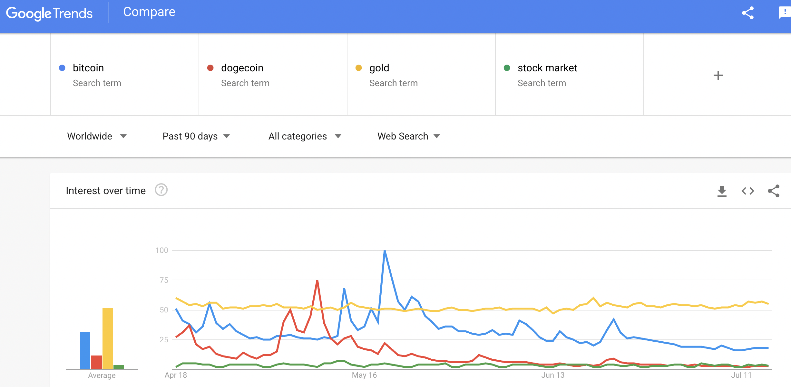

```{r setup, include=FALSE}
knitr::opts_chunk$set(echo = TRUE,
                      message=FALSE,
                      warning=FALSE)
```


## Google Trends package

Continued exploration from google-trends-01.Rmd of the capabilities of the 
**gtrendsR** package created by Philippe Massicotte <br  />
[gtrendsR vignette](https://cran.r-project.org/web/packages/gtrendsR/gtrendsR.pdf)

Focus here is on using gtrendsR with **more than 5 search terms**:

* Google Trends online interface allows for up to 5 search terms at the same time.
* gtrendsR has this same limitation.
* a benefit of gtrendsR is that you can do multiple queries with up to 5 search terms each, and as long as you have one search term that is used from one query to another, you can align all the terms together.

The example will explain what I mean.

Libraries used:

```{r}
library(gtrendsR) ## package for accessing Google Trends
library(tidyverse)
library(lubridate)
library(scales)
library(plotly)
library(gridExtra)
library(RColorBrewer)

## set default ggplot2 chart theme
theme_set(theme_light())
```

## Query 1: 5 search terms

The above example shows how easy way it is to work with individual terms. gtrendsR also allows for working with multiple terms. The same limit of 5 search terms as in the Google Trends interface applies. 

### Set query parameters

```{r}
srch_term <- c("cryptocurrency",
               "stock market",
               "real estate",
               "gold",
               "casino")
period <- "today 3-m"
ctry <- "" ## blank = world; based on world countries ISO code
prop <- c("web")
cat <- 0 ## 0 = all categories

## user-friendly versions of parameters for use in chart titles or other query descriptions
ctry_ <- ifelse(ctry=="","world",ctry)
prop_ <- paste0(prop, collapse=", ")
cat_ <- ifelse(cat==0,"all",cat)
```

### Get results

```{r}
## use gtrendsR to call google trends API
gt_results <- gtrends(keyword=srch_term,
        geo=ctry,
        time=period,
        gprop=prop,
        category=cat)
```

* Trend data is in the 'interest_over_time' object that is returned

These are the keywords within the 'interest_over_time':

```{r}
unique(gt_results$interest_over_time$keyword)
```

### Interest over time for multiple keywords

Trends for the search terms for the selected search term, country, period, property, and category.

```{r}
chart_title <- paste0("Searches for: ",paste0(srch_term, collapse=", "))
sub_title <- paste0("Period: ", period, "; Geo: ",ctry_,"; Prop: ", prop_,"; Category: ", cat_)

gt_results$interest_over_time %>% ggplot(aes(x=date, y=hits, color=keyword))+geom_line()+
  labs(title=chart_title, subtitle=sub_title, x="", y="")

```
Everything looks reasonable. 

### Create trends data frame

Capture these trends in new data frame to save results separately for ease of use later.

```{r}
gt_initial <- gt_results$interest_over_time
```

View a random selection of rows:

```{r}
row_select <- sample(1:nrow(gt_initial), size=10, replace = FALSE)
row_select <- sort(row_select)
gt_initial[row_select,]
```

## Query 2: New terms + one of the previous

* all the other parameters stay constant - esp. date range

### New search terms

```{r}
srch_term <- c("cryptocurrency",
               "bitcoin",
               "ethereum",
               "dogecoin"
               )
```

### Get results & visualize

```{r}
## use gtrendsR to call google trends API
gt_results <- gtrends(keyword=srch_term,
        geo=ctry,
        time=period,
        gprop=prop,
        category=cat)
```

```{r}
chart_title <- paste0("Searches for: ",paste0(srch_term, collapse=", "))
sub_title <- paste0("Period: ", period, "; Geo: ",ctry_,"; Prop: ", prop_,"; Category: ", cat_)

gt_results$interest_over_time %>% ggplot(aes(x=date, y=hits, color=keyword))+geom_line()+
  labs(title=chart_title, subtitle=sub_title, x="", y="")
```

### Create new trends data frame

```{r}
gt_additional <- gt_results$interest_over_time
```

### Calculate ratios

In order to align the additional search term results with the initial set, we calculate the ratio of searches on additional terms to the term that is in both sets - let's call this the **'anchor term'** and the others the **'comparison terms'**.

Easiest way I can think of to do that is to pivot the new data set so that keywords are in columns. Then we can calculate across.

1. Pivot wider: create separate columns for each keyword

```{r}
gt_additional_comp <- gt_additional %>% pivot_wider(names_from='keyword',
                                                    values_from='hits')
```

2. Create new columns with ratio calculations of search on additional terms relative to anchor term

```{r}
## specify anchor term
anchor_term <- "cryptocurrency"
## identify index of anchor term
anchor_col <- which(names(gt_additional_comp)==anchor_term)
## get col indexes of keyword cols (depending on number of keywords)
comp_col <- c(6:ncol(gt_additional_comp))
## remove anchor col index
comp_col <- comp_col[comp_col!=anchor_col]

gt_additional_comp_calc <- gt_additional_comp 

for(c in 1:length(comp_col)){
  ## make the calc based on col references -> this creates a nested list col 'comp_calc'
  gt_comp_calc <- gt_additional_comp %>% mutate(
    comp_calc=gt_additional_comp[comp_col[c]]/gt_additional_comp[anchor_col]
  )
  ## extract calc data as single col data frame (easy to work with)
  gt_comp <- gt_comp_calc$comp_calc
  ## change col name to be distinct
  names(gt_comp) <- paste0(names(gt_additional_comp)[comp_col[c]],"_ratio")
  ## add ratio col to existing data
  gt_additional_comp_calc <- bind_cols(gt_additional_comp_calc, gt_comp)
}
```

### Apply ratios to initial data set

Take the ratio cols and apply to initial data set to calculate relative values:

1. Pivot wide on initial data set
2. Add ratio cols
3. Calculate relative search vol for additional terms in context of initial terms
4. Pivot long for tidy data

```{r}
## pivot wide to get keywords in columns
gt_initial_wide <- gt_initial %>% pivot_wider(names_from='keyword',
                                                    values_from='hits')
```

```{r}
## get ratio columns
gt_additional_comp_ratio <- gt_additional_comp_calc %>% select(ends_with("_ratio"))

## add ratio columns to initial set
gt_initial_wide_ratio <- bind_cols(gt_initial_wide, gt_additional_comp_ratio)

## calculate values based on ratios, using the anchor column
## identify index of anchor term
anchor_col <- which(names(gt_initial_wide_ratio)==anchor_term)
## get col indexes of keyword cols (depending on number of keywords)
ratio_col <- which(grepl("_ratio", names(gt_initial_wide_ratio)))

gt_initial_wide_calc <- gt_initial_wide_ratio 

for(c in 1:length(ratio_col)){
  ## make the calc based on col references -> this creates a nested list col 'comp_calc'
  gt_search_calc <- gt_initial_wide_calc %>% mutate(
    search_calc=gt_initial_wide_calc[ratio_col[c]] * gt_initial_wide_calc[anchor_col]
  )
  ## extract calc data as single col data frame (easy to work with)
  gt_search <- gt_search_calc$search_calc
  ## change col name to keyword
  names(gt_search) <- str_replace(names(gt_search),"_ratio","")
  ## add ratio col to existing data
  gt_initial_wide_calc <- bind_cols(gt_initial_wide_calc, gt_search)
}
## remove ratio cols - no longer needed
gt_trends_all_wide <- gt_initial_wide_calc %>% select(!ends_with("_ratio"))

## pivot longer for tidy data
## cols: columns to pivot into single col - from 6 to number of cols in data frame
## names_to: specify column name to gather into
## values_to: specify metric column name
gt_trends_all <- gt_trends_all_wide %>% pivot_longer(cols=c(6:ncol(gt_trends_all_wide)), names_to="keyword", values_to="hits")
```

### Visualize

* note that terms may exceed the Google Trends max index of 100, depending on relative volume to the anchor term 

```{r}
chart_title <- "Searches for all terms selected"
all_t <- gt_trends_all %>% ggplot(aes(x=date, y=hits, color=keyword))+geom_line()+
  labs(title=chart_title, x="", y="")
ggplotly(all_t)
```

### Validate

Check against Google Trends results for selected terms

```{r}
## select from list of keywords, by index in list
terms <- unique(gt_trends_all$keyword)[c(2,4,6,8)]
sel_terms <- paste(terms, collapse="|")
## filter for selection
gt_sel <- gt_trends_all %>% filter(grepl(sel_terms, gt_trends_all$keyword))

## one-time save results for reproducibility of current results with current Google Trends example
#write_csv(gt_sel, 'data/gt-validation.csv')
## read back in
gt_sel_imp <- read_csv('data/gt-validation.csv')
```


```{r, fig.height=4, fig.width=8.5}
chart_title <- "Selected terms for comparison wtih Google Trends online"

## use custom palette to match Google Trends colors for easier comparison
## bitcoin: blue, dogecoin: red; gold: gold, stock market: green
## assemble palette from RColorBrewer (can also specify colors in-line, as shown below)
cust_pal <- brewer.pal(n=8, name='Dark2')[c(3,4,6,1)]

sel_t <-  gt_sel_imp %>% 
  ggplot(aes(x=date, y=hits, color=keyword))+geom_line()+
  #scale_color_manual(values=c("blue","red","gold","green"))+
  scale_color_manual(values=cust_pal)+
  theme(legend.position = "top")+
  labs(title=chart_title, subtitle=sub_title, x="", y="")
ggplotly(sel_t) %>% layout(legend = list(
      orientation = "h",
      y=1.07
    )
  )
```

<insert image>


Solid match: scales are different but relative volumes very consistent!

=======================================================================

## Improvement Idea:

* create initial list of all the keywords of interest (more than 5).
* identify anchor term
* break list up into groups with anchor term.
* repeat process as many times as necessary to cover all terms in groups of 5 or less (with the anchor term included each time).